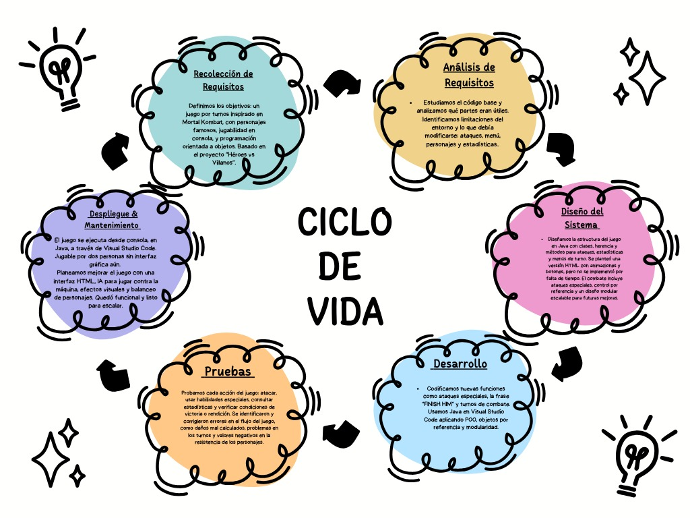
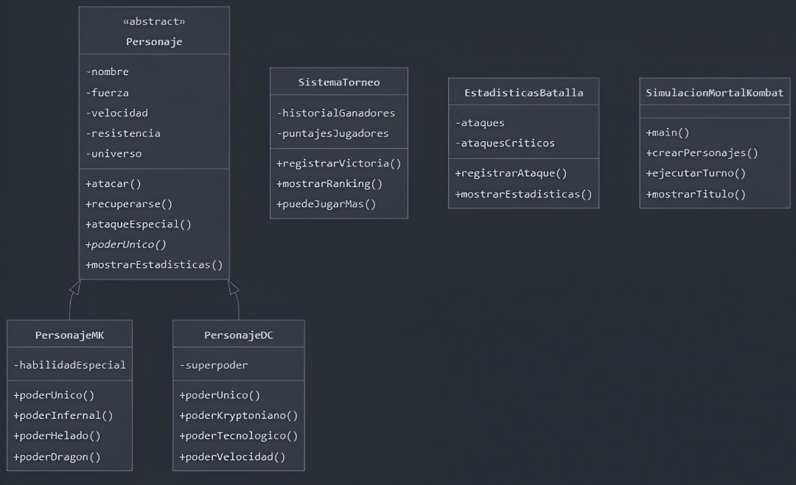

## 🎮 Mortal Kombat vs DC Comics - Batalla Épica


## 🎯 Objetivo del Proyecto

Este proyecto grupal surgió de un desafío creativo que nos dio nuestroprofesor de una vatalla de super heroes que debiamos modificar y lo que nosotros hicimos fue transformar un sistema de combate entre superhéroes en una experiencia auténtica de Mortal Kombat. Nuestro objetivo principal fue:

Recrear la esencia brutal de Mortal Kombat en un juego por turnos para consola, manteniendo la elegancia técnica de la programación orientada a objetos

Logros clave que perseguimos:
1. 🔄 Conversión temática completa  
   De héroes genéricos a personajes icónicos de MK con ataques característicos
2. ⚔️ Mecánicas de combate mejoradas  
   Implementación de ataques especiales únicos y el emblemático "FINISH HIM"
3. 🤝 Demostración práctica de POO  
   Uso avanzado de herencia, polimorfismo y paso por referencia en el sistema de daños
4. 🎮 Experiencia de usuario inmersiva  
   Menú intuitivo con acciones estratégicas por turno para 2 jugadores

El resultado: Un tributo funcional al universo Mortal Kombat que superó las limitaciones del código original, demostrando cómo la colaboración y la adaptación técnica pueden reinventar completamente un sistema de juego.

### 🌀 CICLO DE VIDA 


 


Combate interdimensional entre personajes de Mortal Kombat y DC Comics implementado en Java con programación orientada a objetos.

°⚙️ Características Principales
- ✅ Sistema de combate por turnos con mecánicas avanzadas
- ✅ 10 personajes únicos (5 de MK, 5 de DC) con habilidades especiales
- ✅ Sistema de estadísticas y ranking de torneos
- ✅ Poderes únicos específicos para cada personaje
- ✅ Mecánicas de críticos, recuperación y ataques especiales
- ✅ Interfaz de consola intuitiva con mensajes detallados

📦 Estructura de Código




la mecanica del juego que se muestra en la consola 

° 🕹️ Mecánicas de Juego
| Acción                  | Descripción                                        |
|-------------------------|----------------------------------------------------|
| 👊   Atacar            | Ataque básico con 15% de probabilidad de crítico   |
| ⚡   Ataque Especial   | Daño = Fuerza + Velocidad                          |
| 🌟   Poder Único       | Habilidad única por batalla (ej: "GET OVER HERE!") |
| 💚   Recuperarse       | Restaura 15-25 puntos de resistencia               |
| 📊   Ver Stats         | Muestra estadísticas de ambos personajes           |
| 🏃   Huir              | Termina la batalla (derrota automática)            |


° 🧑‍💻 Ejemplo de Flujo
los jugadores hacen la seleccion de personajes 
Jugador 1 elige: Scorpion (Mortal Kombat)
Jugador 2 elige: Superman (DC Comics)

// Combate
🔥 Scorpion usa su poder único: 
"¡GET OVER HERE!" (Daño masivo de fuego)
⚡ Superman contraataca con Visión de Calor

° 📊 Sistema de Torneos
- Máximo 10 partidas
- Puntaje basado en resistencia restante + bonificación por rondas
- Historial de ganadores y ranking comparativo


## 🚀 Cómo ejecutar
1. **Requisitos**:  
   ```bash
   Java JDK 8+ instalado
   ```
2. **Compilación**:  
   ```bash
   javac MortalKombat.java
   ```
3. **Ejecución**:  
   ```bash
   java MortalKombat
   ```

INTEGRANTES                       |  CODIGOS     |
----------------------------------|--------------|
GALVIS GALVIS RUBIEL ANDREY       |  [192483]    |
FLOREZ SUAREZ JUAN JOSE           |  [192466]    |
AMAYA SANCHEZ FEYBER DANILO       |  [192473]    |
ASCANIO TARAZONA JHORMAN ESNEIDER |  [192534]    |

|       INTEGRANTES      | Rol Principal          | Programación                                                      | Explicación Técnica                                                                 |
|------------------------|------------------------|-------------------------------------------------------------------|-------------------------------------------------------------------------------------|
|    FEYBER AMAYA        | **Aquitectura POO**   | - Clases base<br>- Herencia<br>- Polimorfismo                     | Diseñó jerarquía de clases con `Personaje` como abstracta e implementaciones específicas (`PersonajeMK`, `PersonajeDC`) usando polimorfismo en métodos clave como `poderUnico()` |
|   ANDREY GALVIS        | **Lógica de Combate**  | - Sistema de turnos<br>- Daños<br>- Acciones especiales           | Implementó mecánica de turnos con colas de acciones, fórmulas de daño contextuales \[daño = fuerza × modificador\] y efectos de estado temporales |
|    JUAN FLORES         |**Gestión de Estados** | - Barra de resistencia<br>- Efectos de estado<br>- Validaciones   | Creó sistema de recursos con regeneración progresiva \[stamina_{t+1} = stamina_t + Δt × regeneración\] y máquina de estados para condiciones |
|   JHORMAN ASCANIO      |**Experiencia de Usuario** | - Menú interactivo<br>- Pantallas<br>- Visualización de stats | Desarrolló interfaz navegable con HUD dinámico usando Observer Pattern para actualización en tiempo real |